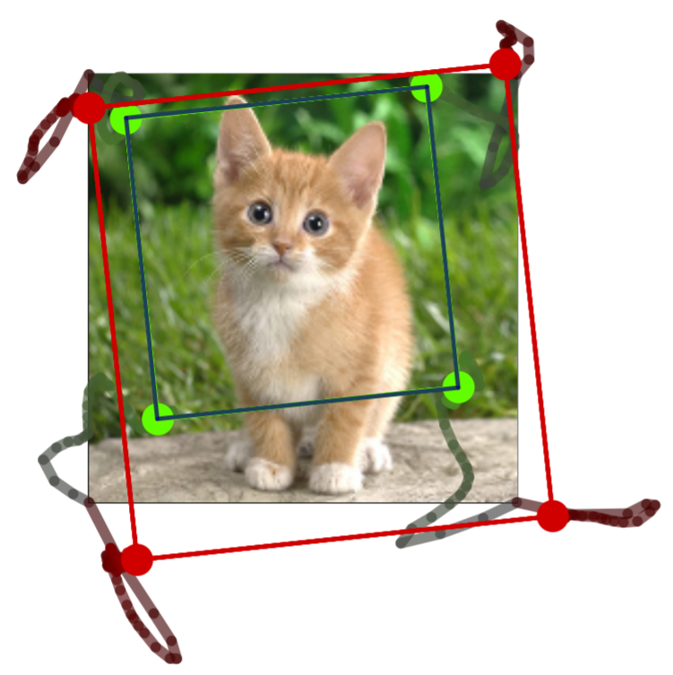
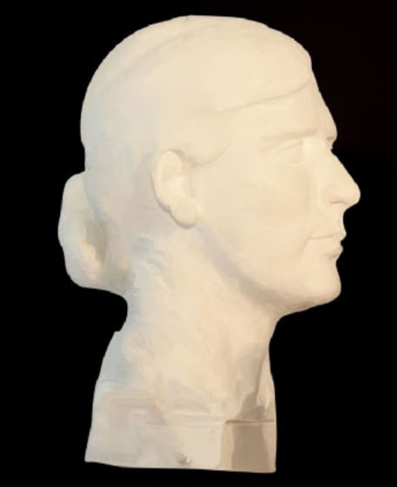

## Wei Jiang

I'm currently a Phd student in hyperparameter tuning under the supervision of Prof. Kwang Moo Yi at University of Victoria, Canada.

## Publications

|                                                              |                                                              |
| :----------------------------------------------------------- | ------------------------------------------------------------ |
|  | **Linearized Multi-Sampling for Differentiable Image Transformation** Wei Jiang, Weiwei Sun, Andrea Tagliasacchi, Eduard Trulls, Kwang Moo Yi ICCV 2019 [[arXiv](https://arxiv.org/abs/1901.07124/)] |
|  | **Depth-aware image vectorization and editing** Shufang Lu, Wei Jiang, Xuefeng Ding, Craig S. Kaplan, Xiaogang Jin, Fei Gao, Jiazhou Chen Computer Graphics International 2019 [[Blog](./blogs/diffusion_curves_blog.html)] |
