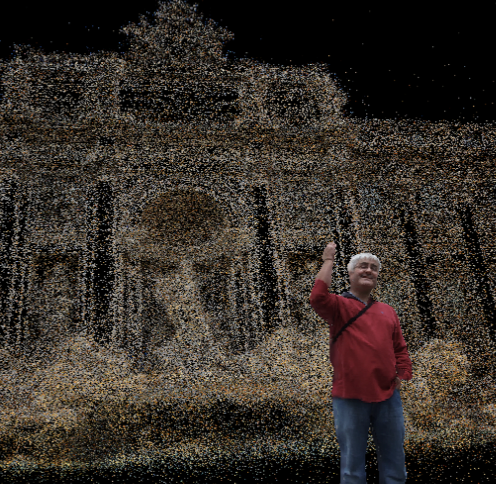
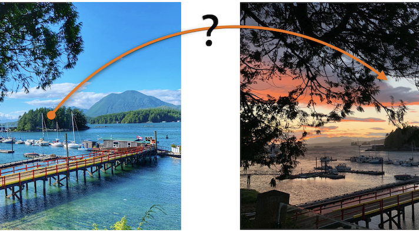
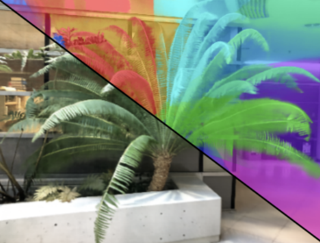
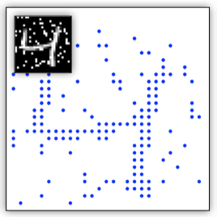
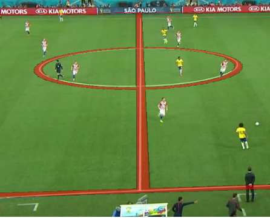

## Wei Jiang (蒋炜)

I'm a 4th year PhD student in hyper-parameter tuning under the supervision of [Prof. Kwang Moo Yi](https://www.cs.ubc.ca/~kmyi/) at [Computer Vision Lab](https://vision.cs.ubc.ca/), University of British Columbia, Canada.
Currently I'm interning at Apple with [Anurag Ranjan](https://anuragranj.github.io/). In 2020, I interned at Huawei with [Prof. Yang Wang](https://www.cs.umanitoba.ca/~ywang/).

* Email: jiangwei1993@gmail.com
* Here is my [resume](./pdfs/jw_resume.pdf)
* [my Google Scholar](https://scholar.google.com/citations?user=OsqGLUAAAAAJ&hl)

## Publications

|                                                              |                                                              |
| :----------------------------------------------------------- | ------------------------------------------------------------ |
|  | **Novel-View Synthesis of Human Tourist Photos** Jonathan Freer, Kwang Moo Yi, <ins>Wei Jiang</ins>, Jongwon Choi, Hyung Jin Chang WACV 2022 [[paper](https://openaccess.thecvf.com/content/WACV2022/papers/Freer_Novel-View_Synthesis_of_Human_Tourist_Photos_WACV_2022_paper.pdf)]|
|  | **COTR: Correspondence Transformer for Matching Across Images** <ins>Wei Jiang</ins>, Eduard Trulls, Jan Hosang, Andrea Tagliasacchi, Kwang Moo Yi [ICCV 2021 oral](https://youtu.be/bOZ12kgfn3E) [[arXiv](https://arxiv.org/abs/2103.14167)] [[video](./vids/cotr/README.html)] [[code](https://github.com/ubc-vision/COTR)]|
|  | **DeRF: Decomposed Radiance Fields** Daniel Rebain, <ins>Wei Jiang</ins>, Soroosh Yazdani, Ke Li, Kwang Moo Yi, Andrea Tagliasacchi CVPR 2021 [[arXiv](https://arxiv.org/abs/2011.12490)] [[project](https://ubc-vision.github.io/derf/)] [[code](https://github.com/ubc-vision/derf/)] |
|  | **Attentive Context Normalization for Robust Permutation-Equivariant Learning** Weiwei Sun, <ins>Wei Jiang</ins>, Eduard Trulls, Andrea Tagliasacchi, Kwang Moo Yi [CVPR 2020](https://www.youtube.com/watch?v=sBxguUF3XAQ) [[arXiv](https://arxiv.org/abs/1907.02545)] [[code](https://github.com/vcg-uvic/acne)] |
|  | **Optimizing Through Learned Errors for Accurate Sports Field Registration** <ins>Wei Jiang</ins>, Juan Camilo Gamboa Higuera, Baptiste Angles, Weiwei Sun, Mehrsan Javan, Kwang Moo Yi [WACV 2020](https://www.youtube.com/watch?v=HiE5yFoT7wY&list=PL_bDvITUYucC_TaW84be8iharg4Vj3UVj&index=1&t=4219s) [[arXiv](https://arxiv.org/abs/1909.08034)] [[video](./vids/sportsfield/README.html)] [[code](https://github.com/vcg-uvic/sportsfield_release)] [[poster](./pdfs/sportsfield_poster.pdf)] |
|  | **Linearized Multi-Sampling for Differentiable Image Transformation** <ins>Wei Jiang</ins>, Weiwei Sun, Andrea Tagliasacchi, Eduard Trulls, Kwang Moo Yi [ICCV 2019 oral](https://youtu.be/qUu1076IMWo?t=2299) [[arXiv](https://arxiv.org/abs/1901.07124/)] [[code](https://github.com/vcg-uvic/linearized_multisampling_release)] [[poster](./pdfs/iccv_2019_poster.pdf)] |
|  | **Depth-aware image vectorization and editing** Shufang Lu, <ins>Wei Jiang</ins>, Xuefeng Ding, Craig S. Kaplan, Xiaogang Jin, Fei Gao, Jiazhou Chen The Visual Computer/Computer Graphics International 2019 [[Paper](https://link.springer.com/article/10.1007%2Fs00371-019-01671-0)] |

## Fellowships & Awards

* 2019 - 2021, UVic Fellowship
* 2019.4, UVic Graduate Award

## Experiences

* 2021.5 - Present, Research intern at Apple, Canada
* 2020.5 - 2020.9, Assistant engineer intern at Huawei, Canada
* 2020.1 - 2020.4, Teaching assistant of CSC 486B Introduction to Deep Learning for Computer Vision at University of Victoria, Victoria, Canada
* 2019.1 - 2019.4, Teaching assistant of CSC 305 Introduction to Computer Graphics at University of Victoria, Victoria, Canada
* 2018.5 - 2018.8, Algorithm intern at KATVR, Hangzhou, China
* 2017.5 - 2017.8, Backend intern at AdaptiveAlgo, Boston, MA

## Reviewing Activities

- 2019: ICCV, BMVC
- 2020: AAAI, CVPR, IJCAI, ECCV, ACCV
- 2021: WACV, ICCV
