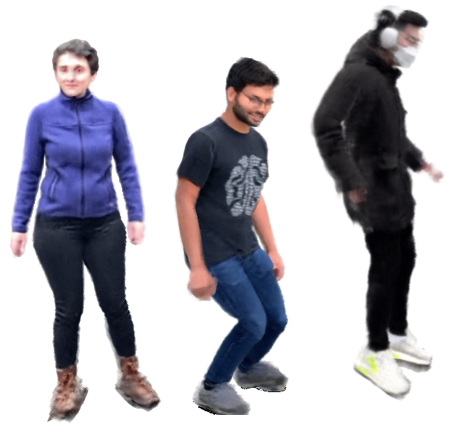
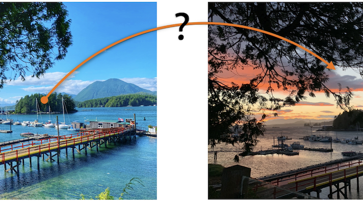
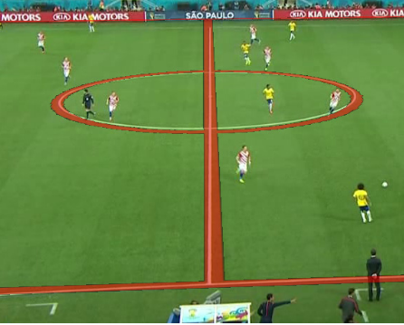
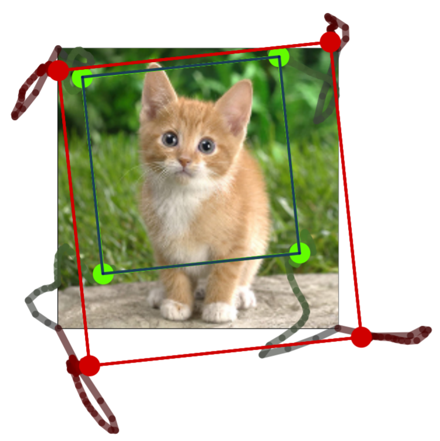
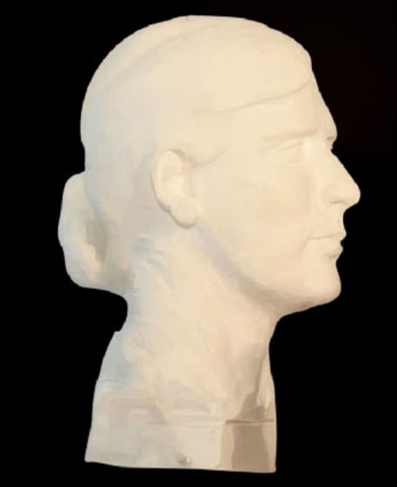

## Wei Jiang (蒋炜)

I am a Machine Learning Engineer at [Apple](https://www.apple.com), working on machine learning and computer vision to enable Apple experiences. I received my PhD from the University of British Columbia, where I was advised by [Prof. Kwang Moo Yi](https://www.cs.ubc.ca/~kmyi/). My background spans computer vision, 3D vision, and generative AI, with particular interests in visual localization and novel view synthesis.
Previously, I was a Research Scientist at [Haiper.ai](https://www.haiper.ai), where I worked on 3D reconstruction and AI-generated content.

* Email: jiangwei1993@gmail.com
* [Google Scholar](https://scholar.google.com/citations?user=OsqGLUAAAAAJ&hl)
* [GitHub](https://github.com/jiangwei221)

## Selected Publications

|                                                              |                                                              |
| :----------------------------------------------------------- | ------------------------------------------------------------ |
|  | **NeuMan: Neural Human Radiance Field from a Single Video** <ins>Wei Jiang</ins>, [Kwang Moo Yi](https://www.cs.ubc.ca/~kmyi/), [Golnoosh Samei](https://scholar.google.com/citations?user=kDrzTfsAAAAJ&hl=en), [Oncel Tuzel](https://www.onceltuzel.net), [Anurag Ranjan](https://anuragranj.github.io/) ECCV 2022 [[arXiv](https://arxiv.org/abs/2203.12575)] [[paper](https://www.ecva.net/papers/eccv_2022/papers_ECCV/html/3737_ECCV_2022_paper.php)] [[code](https://github.com/apple/ml-neuman)] [[project](https://machinelearning.apple.com/research/neural-human-radiance-field)] [[video](https://youtu.be/zEWuSxUsbEs)] [[poster](./pdfs/neuman_poster.pdf)]|
|  | **COTR: Correspondence Transformer for Matching Across Images** <ins>Wei Jiang</ins>, [Eduard Trulls](https://etrulls.github.io), [Jan Hosang](https://janhosang.com), [Andrea Tagliasacchi](https://taiya.github.io), [Kwang Moo Yi](https://www.cs.ubc.ca/~kmyi/) [ICCV 2021 oral](https://youtu.be/bOZ12kgfn3E) [[arXiv](https://arxiv.org/abs/2103.14167)] [[video](./vids/cotr/README.html)] [[code](https://github.com/ubc-vision/COTR)]|
|  | **Optimizing Through Learned Errors for Accurate Sports Field Registration** <ins>Wei Jiang</ins>, [Juan Camilo Gamboa Higuera](http://cim.mcgill.ca/~gamboa/), [Baptiste Angles](https://scholar.google.ca/citations?user=TINTysAAAAAJ&hl=en), [Weiwei Sun](https://wsunid.github.io), [Mehrsan Javan](https://scholar.google.ca/citations?user=3S8O0b4AAAAJ&hl=en), [Kwang Moo Yi](https://www.cs.ubc.ca/~kmyi/) [WACV 2020](https://www.youtube.com/watch?v=HiE5yFoT7wY&list=PL_bDvITUYucC_TaW84be8iharg4Vj3UVj&index=1&t=4219s) [[arXiv](https://arxiv.org/abs/1909.08034)] [[video](./vids/sportsfield/README.html)] [[code](https://github.com/vcg-uvic/sportsfield_release)] [[poster](./pdfs/sportsfield_poster.pdf)] |
|  | **Linearized Multi-Sampling for Differentiable Image Transformation** <ins>Wei Jiang</ins>, [Weiwei Sun](https://wsunid.github.io), [Andrea Tagliasacchi](https://taiya.github.io), [Eduard Trulls](https://etrulls.github.io), [Kwang Moo Yi](https://www.cs.ubc.ca/~kmyi/) [ICCV 2019 oral](https://youtu.be/qUu1076IMWo?t=2299) [[arXiv](https://arxiv.org/abs/1901.07124/)] [[code](https://github.com/vcg-uvic/linearized_multisampling_release)] [[poster](./pdfs/iccv_2019_poster.pdf)] |
|  | **Depth-aware image vectorization and editing** [Shufang Lu](https://scholar.google.com/citations?user=fEN2q1sAAAAJ&hl=en), <ins>Wei Jiang</ins>, Xuefeng Ding, [Craig S. Kaplan](https://cs.uwaterloo.ca/~csk/), [Xiaogang Jin](http://www.cad.zju.edu.cn/home/jin/), Fei Gao, [Jiazhou Chen](http://www.cad.zju.edu.cn/home/chenjiazhou/) The Visual Computer/Computer Graphics International 2019 [[Paper](https://link.springer.com/article/10.1007%2Fs00371-019-01671-0)] |

## Experience

* 2025.6 - Present, Machine Learning Engineer at Apple, USA
* 2023.1 - 2025.1, Research Scientist at Haiper.ai, Canada
* 2021.5 - 2022.7, Research Intern at Apple, Canada
* 2020.5 - 2020.9, Assistant Engineer Intern at Huawei, Canada
* 2020.1 - 2020.4, Teaching Assistant for CSC 486B Introduction to Deep Learning for Computer Vision at University of Victoria, Victoria, Canada
* 2019.1 - 2019.4, Teaching Assistant for CSC 305 Introduction to Computer Graphics at University of Victoria, Victoria, Canada
* 2018.5 - 2018.8, Algorithm Intern at KATVR, Hangzhou, China
* 2017.5 - 2017.8, Backend Intern at AdaptiveAlgo, Boston, MA

## Fellowships & Awards

* 2019 - 2021, UVic Fellowship
* 2019.4, UVic Graduate Award

## Professional Service

- 2019: ICCV, BMVC
- 2020: AAAI, CVPR, IJCAI, ECCV, ACCV
- 2021: WACV, ICCV
- 2022: TIP, TPAMI
